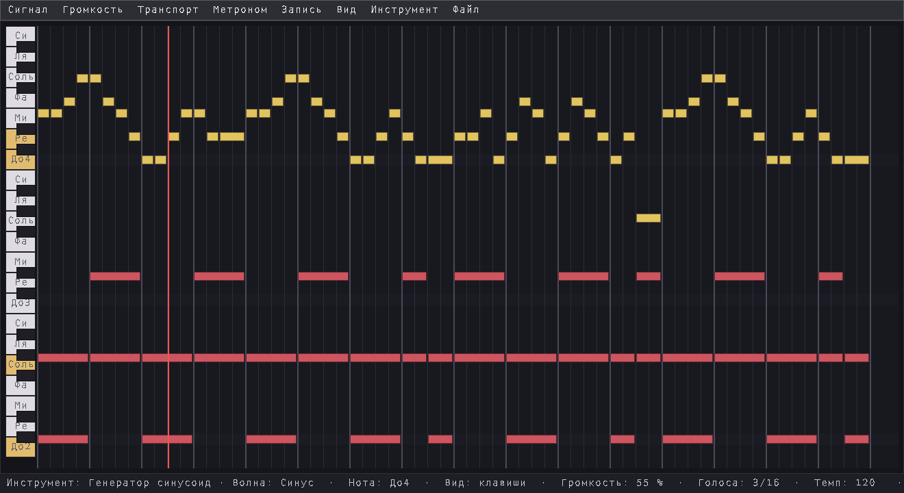
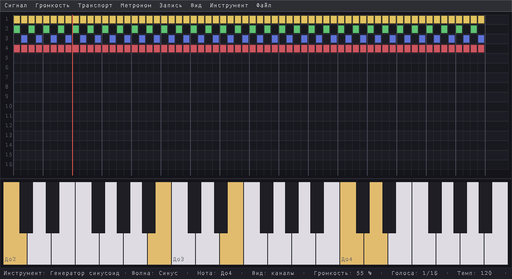
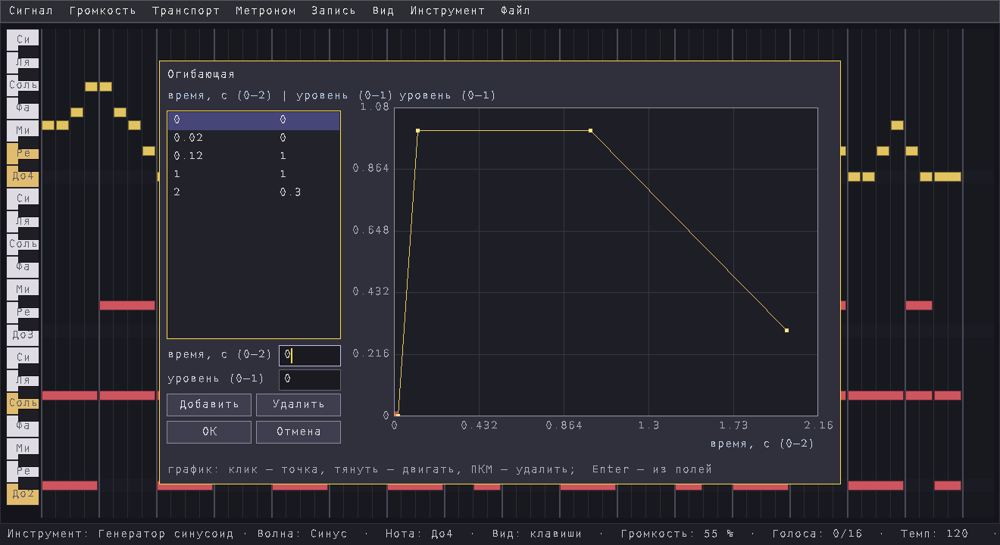

# SymphoniaMechanica

A music synthesizer with a step-sequencer timeline.

Four waveforms (saw, square, triangle, sine) with an editable volume envelope,
16 voices, a 36-key keyboard (C2–B4) and a timeline of 64 beats. Put notes on
the timeline with the mouse, play them back with a metronome, play live on the
on-screen keyboard and record the output to a WAV file. Runs on Linux x86-64.
**The user interface and this documentation are in Russian.** This repository
holds the ready-to-run program only — no source code.

---

**SymphoniaMechanica** — музыкальный синтезатор с лентой времени. Ноты
ставятся на ленту мышью, без навыков игры на инструменте: щелчок по клетке —
нота, протяжка вдоль строки — одна длинная нота. Ленту проигрывают под
метроном, на экранной клавиатуре играют вживую, а всё звучащее записывают в
WAV.

В этом репозитории лежит готовая к запуску программа. Исходников здесь нет.

## Как это выглядит



**Вид «Клавиши».** Слева — клавиатура, повёрнутая набок: низкие ноты внизу,
высокие вверху, по строке на клавишу. Справа — сетка на 64 доли, тонкие линии
— доли, жирные — такты. На ленте «Ода к радости» Бетховена: мелодия синусом
(жёлтые ноты), бас пилой (красные, протянуты на весь такт). Красная вертикаль
— плейхед, подсвеченные клавиши сейчас звучат.



**Вид «16 каналов».** Та же пьеса, разложенная на четыре дорожки: мелодия,
два голоса гармонии и бас, у каждой дорожки своя форма волны. Цвет ноты
показывает волну. Внизу — клавиатура, на ней можно играть вживую.



**Редактор огибающей.** Кривая громкости ноты во времени: быстрая атака, ровная
часть и медленный спад. Точки ставят и двигают мышью или вводят числами.

## Возможности

- **Лента времени** на 36 дорожек и 64 доли, темп от 60 до 180 ударов в
  минуту. Два вида одной ленты: «Клавиши» (сетка, где строка — это клавиша) и
  «16 каналов» (дорожки над клавиатурой).
- **Синтез:** 16 голосов, волны пила, прямоугольник, треугольник и синус.
  Огибающая громкости — ломаная до 32 точек в окне 2 секунды. Нота той же
  высоты после паузы продолжает фазу генератора, а не начинает её с нуля.
- **Протяжка мышью даёт одну сплошную ноту:** звук не прерывается на
  границах клеток.
- **Метроном** с акцентом на первую долю такта.
- **Живая игра** на экранной клавиатуре.
- **Запись в WAV** (48 кГц) всего, что уходит в динамики, до 60 секунд.

## Что нужно для запуска

| | |
|---|---|
| Система | Linux x86-64 с glibc 2.38 или новее: Ubuntu 24.04, Linux Mint 22, Debian 13, Fedora 39 и новее |
| Библиотеки | SDL2 2.0.18 или новее, libstdc++ из GCC 11 или новее |
| Звук | PulseAudio, PipeWire или ALSA — то, что умеет SDL2 |

В Ubuntu, Mint и Debian SDL2 ставится одной командой:

```sh
sudo apt install libsdl2-2.0-0
```

## Установка и запуск

```sh
git clone https://github.com/TchDuke/SymphoniaMechanica.git
cd SymphoniaMechanica
./SymphoniaMechanica
```

Если репозиторий скачан ZIP-архивом и программа не запускается с ошибкой
«Permission denied», распаковщик не сохранил признак исполняемого файла.
Верните его:

```sh
chmod +x SymphoniaMechanica
```

Программу можно запускать из любого каталога. Шрифт `default.vfont` должен
лежать рядом с исполняемым файлом.

## Как пользоваться

Всё управление — мышью и через меню. Меню открывается и закрывается клавишей
**F10**.

### Вид «Клавиши» — ноты без навыков игры

Включается в меню **Вид → Клавиши**.

| Действие | Что происходит |
|---|---|
| Щелчок левой кнопкой по пустой клетке | Нота высотой этой строки длиной в одну долю. Звучит короткое прослушивание |
| Щелчок по занятой клетке | Нота снимается. Если клетка внутри длинной ноты, нота делится на две, а клетка становится паузой |
| **Ctrl** + щелчок по пустой клетке | Короткая нота (стаккато) с паузой внутри доли |
| Нажать левую кнопку и вести вдоль строки | Одна длинная нота на все пройденные клетки. Пока кнопка нажата, нота звучит |
| Щелчок правой кнопкой по ноте | Нота снимается |
| Нажать и держать клавишу слева | Клавиша звучит — можно прослушать тон до того, как ставить ноту |

### Вид «16 каналов» — живая игра и пошаговый ввод

Включается в меню **Вид → 16 каналов**.

- **Живая игра.** Нажимайте клавиши экранной клавиатуры мышью. Если вести
  мышь с нажатой кнопкой по клавишам, нота переходит с клавиши на клавишу.
- **Пошаговый ввод** (**Транспорт → Вставка нот**). Щелчок по ленте ставит
  маркер: дорожку и долю. Каждое нажатие клавиши кладёт в эту точку ноту
  длиной в одну долю, и маркер сдвигается на следующую долю.

Оба вида показывают одну и ту же ленту. «16 каналов» рисует первые 16
дорожек, «Клавиши» — все 36.

### Меню

| Меню | Что там |
|---|---|
| **Сигнал** | Форма волны для новых нот и живой игры: пила, прямоугольник, треугольник, синус |
| **Громкость** | Общая громкость, от 10 до 100 % |
| **Транспорт** | **Пуск** — проиграть ленту с начала, **Стоп**, **Вставка нот**, **Очистить ленту** |
| **Метроном** | Включить или выключить щелчки, выбрать темп от 60 до 180 |
| **Запись** | **Записать / остановить** — запись звука в WAV |
| **Вид** | «16 каналов» или «Клавиши» |
| **Инструмент** | **Настройки...** — инструмент и его волна; **Огибающая...** — редактор кривой громкости |
| **Файл** | **Выход** |

Лента проигрывается только после **Транспорт → Пуск**. На конце 64-й доли
проигрывание останавливается само. Метроном щёлкает только во время
проигрывания и в запись не попадает.

### Редактор огибающей

**Инструмент → Огибающая...** По горизонтали — время от 0 до 2 секунд, по
вертикали — уровень от 0 до 1.

- Щелчок по точке выбирает её, дальше точку можно тянуть.
- Щелчок в пустое место графика добавляет точку.
- Щелчок правой кнопкой по точке удаляет её.
- В полях под списком точку задают числами, **Enter** добавляет её.
- **OK** применяет кривую, **Esc** закрывает редактор без изменений.

После двух секунд громкость держится на уровне последней точки. Когда нота
отпущена, звук затухает за 25 мс.

## Где хранятся настройки и записи

Рядом с исполняемым файлом программа создаёт каталог `smp/`:

| | |
|---|---|
| `smp/settings.cfg` | Размер окна, волна, громкость, темп, метроном, вид, инструмент и огибающая |
| `smp/recordings/` | Записи WAV, имя файла — дата и время начала записи |

Поэтому каталог программы должен быть доступен на запись. Чтобы вернуть
настройки по умолчанию, удалите `smp/settings.cfg`.

## Ограничения этой версии

- **Лента не сохраняется** между запусками. Чтобы сохранить мелодию, запишите
  её в WAV.
- Лента — ровно 64 доли, прокрутки и масштаба нет.
- Клавиатура — 36 клавиш, от До2 до Си4.
- Нет экспорта и импорта MIDI.
- Запись WAV — не длиннее 60 секунд.
- В библиотеке инструментов пока одна запись: «Генератор синусоид».

## Лицензия

Программа распространяется по лицензии MIT, см. [LICENSE](LICENSE).
У шрифта `default.vfont` своя лицензия, см. [THIRD_PARTY.md](THIRD_PARTY.md).
